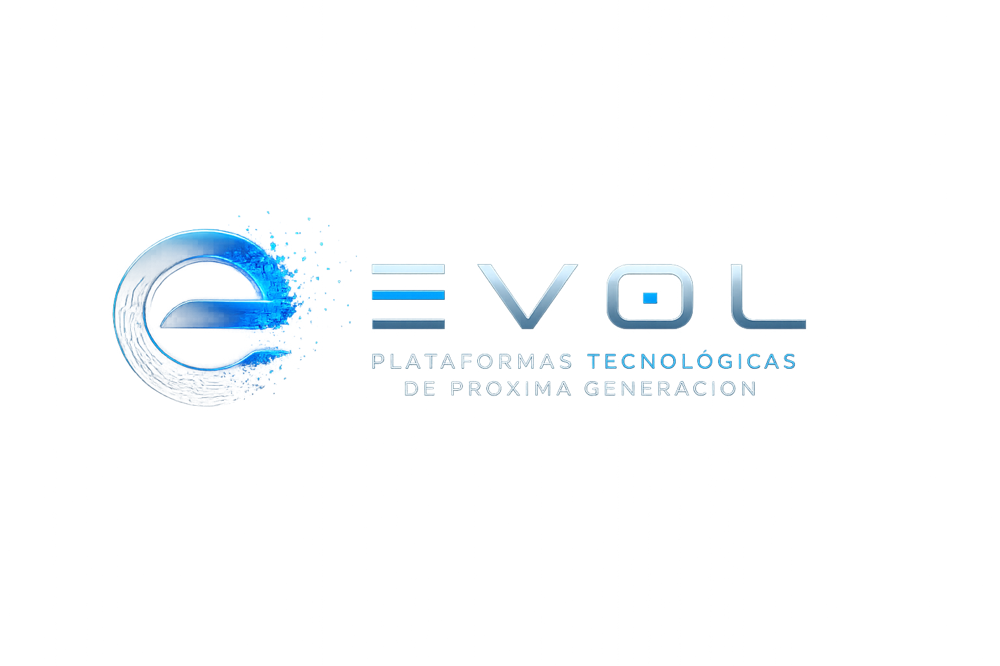

Bienvenido al repositorio oficial de desarrollo del grupo **Evol**.

## 📦 ¿Qué encontrarás en este repositorio?

Este repositorio centraliza los distintos proyectos de software desarrollados por el grupo Evol, incluyendo:

* Aplicaciones web
* APIs y microservicios
* Herramientas internas
* Prototipos y pruebas de concepto
* Librerías reutilizables

Cada proyecto sigue buenas prácticas de desarrollo, incluyendo control de versiones, documentación y estructuras pensadas para escalar.

## 🎯 Objetivo

El objetivo de este repositorio es:

* Consolidar el desarrollo tecnológico del grupo
* Facilitar la colaboración entre equipos
* Mantener estándares de calidad y consistencia
* Servir como base para nuevos desarrollos

## 🤝 Contribuciones

Este es un repositorio activo. Si formas parte del equipo Evol:

1. Sigue las convenciones definidas
2. Documenta tus cambios
3. Mantén la calidad del código
4. Usa ramas y pull requests adecuadamente

## 📄 Licencia

La licencia dependerá de cada proyecto específico dentro del repositorio.

---

💡 *Evol – Creando Plataformas Tecnologicas de Siguiente Generacion*
